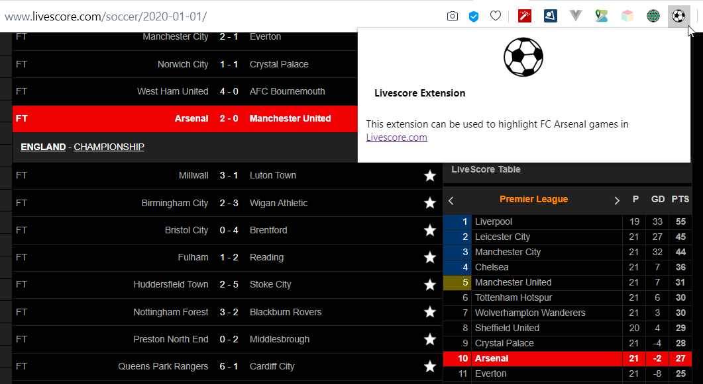
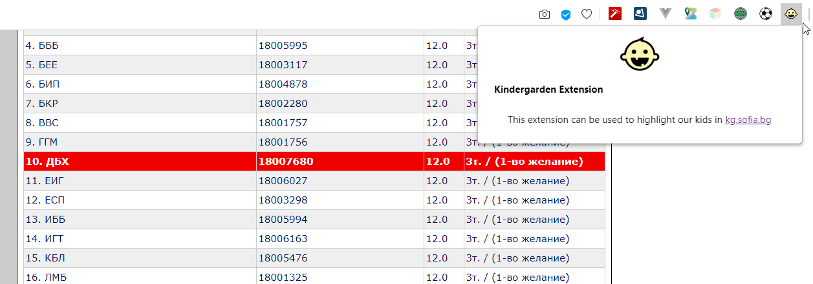
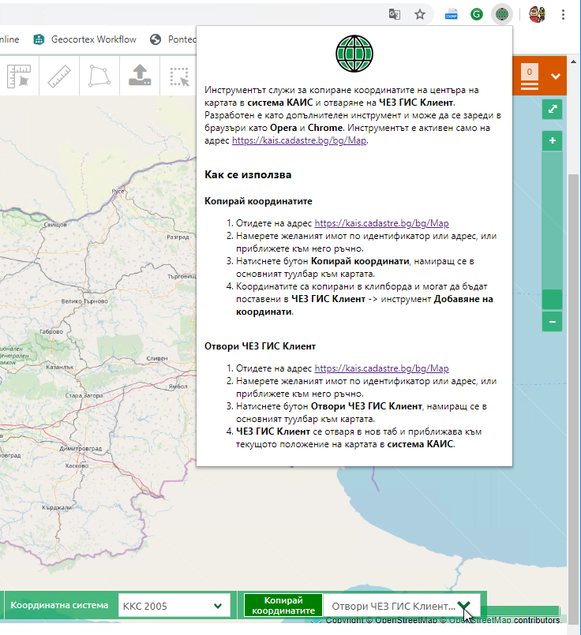

# ArcGIS Server SOE Extension

This extension can be used for adding additional format option in your custom ArcGIS SOE operations. When enabled it adds a new option for
`jsonp` format, which can be used when the operation generates files (returned as `byte[]`).

This extension is enabled only on ArcGIS Server URLs: `*://*/arcgis/rest/services*`

# Geocortex Essentials Extension

This extension will make the lists in Geocortex Esssentials Manager more readable by adding lines between the items.

This extension is enabled only on Geocortex Essentials Manager: `*://*/Geocortex/Essentials/RestManager*`

# Livescore Extension

This extension can be used to highlight FC Arsenal games in [Livescore.com](https://www.livescore.com)

# Kindergarden Extension

This extension can be used to highlight our kids in [kg.sofia.bg](https://kg.sofia.bg/)

# [Pontech Extension for Cadastre](./pontech-extension-cadastre/README.md)

Developed as a chrome extension, this tool can be used to copy map's center coordinates to your clipboard or to open ArcFM Web sites.

# How to install

1. Clone this repo.
2. Open Opera/Chrome browser and navigate to Extensions.
3. Turn on Developer mode.
4. Click on `Load unpacked` button and choose the extension directory.
