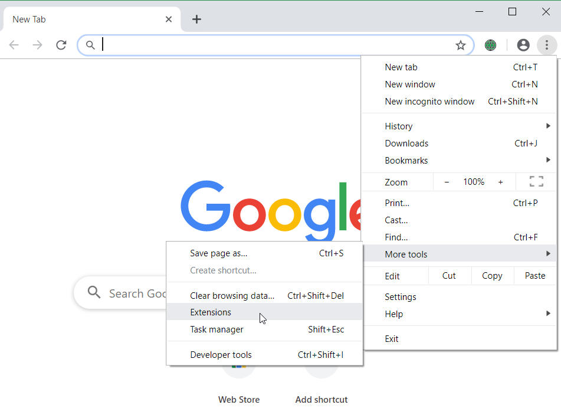
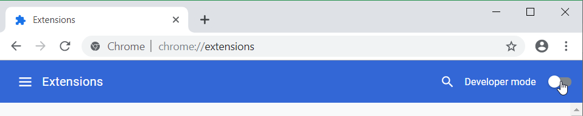
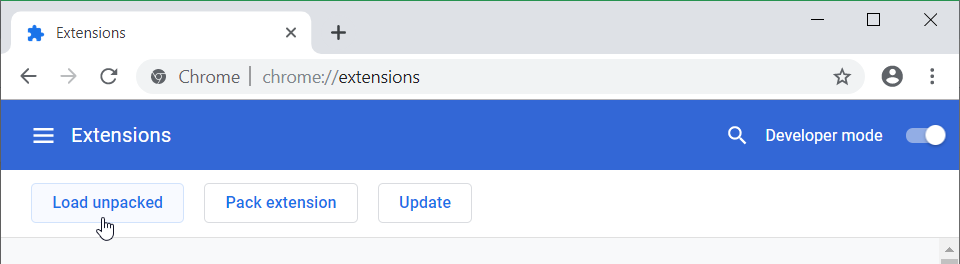
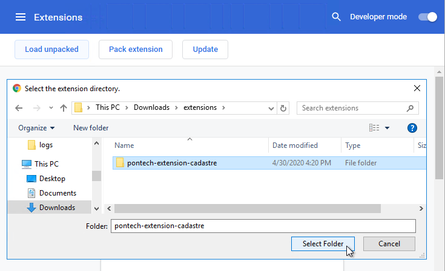

# Pontech Extension for Cadastre

Developed as a chrome extension, this tool can be used to copy map's center coordinates to your clipboard or to open ArcFM Web sites.

This extension can be used in [https://kais.cadastre.bg/bg/Map](https://kais.cadastre.bg/bg/Map) site only. When enabled it adds additional tools to map's toolbar:

- `Copy coordinates` - which can be used to copy map's center coordinates to the clipboard. **The result is in UTM 35N coordinаte system**!
- `Open ArcFM Web` - which can open ArcFM Web page in new tab and zoom to current cadastral map location.

# How to install

1. Clone this repo.
2. Open Opera/Chrome browser and navigate to Extensions.
3. Turn on Developer mode.
4. Click on `Load unpacked` button and choose this directory.
5. `Pontech Еxtension for Cadastre` extension is now available for use!

# How to install from a zip file

1. Extract the zip file somewhere on your computer.
2. Open Opera/Chrome browser and navigate to Extensions.
   
3. Turn on Developer mode.
   
4. Click on `Load unpacked` button.
   
5. And choose the directory where the extension was unzipped.
   
6. `Pontech Extension for Cadastre` extension is now available for use!
   
